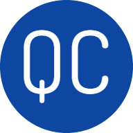

<div align="center">


<br>
<br>
<br>

<p>
QuickClip is a lightweight <I>store & search</I> tool which can be used to store common day to day string values (e.g. email, account, home address, zip code, site, commands, etc..) and keywords to help you find them quickly using a global shortcut which spawns the UI and copies the item to the clipboard and to the focused editor.

QuickClip is not a clipboard manager, it relies on user interaction to store and tag the values to avoid data pollution.

Future releases will also listen to the clipboard to track commonly used copied value and suggested tags

QuickClip is built on <a href="https://electron.atom.io/">Electron</a>, <a href="https://facebook.github.io/react/">React</a> and <a href="https://electron-react-boilerplate.js.org/">Electron React Boilerplate</a>.

</p>

<br>

<div align="center">

[![Build Status][github-actions-status]][github-actions-url]
[![Github Tag][github-tag-image]][github-tag-url]

</div>

<div align="left">
### Install

Clone the repo and install dependencies:

```bash
git clone https://github.com/MichaelShtern/clip-search.git
cd clip-search
npm install
```

### Starting Development

Start the app in the `dev` environment:

```bash
npm start
```

### Packaging for Production

To package apps for the local platform:

```bash
npm run package
```

## Maintainers

- [Michael Shterenberg](https://github.com/MichaelShtern)

## License

MIT © [QuickClip](https://github.com/MichaelShtern/clip-search/blob/v1.0.0/LICENSE)

[github-actions-status]: https://github.com/MichaelShtern/clip-search/actions/workflows/test.yml/badge.svg
[github-actions-url]: https://github.com/MichaelShtern/clip-search/actions/workflows/test.yml
[github-tag-image]: https://img.shields.io/github/tag/MichaelShtern/clip-search.svg?label=version
[github-tag-url]: https://github.com/MichaelShtern/clip-search/releases/latest
